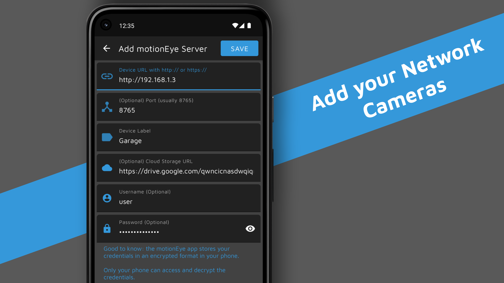

[![Contributors][contributors-shield]][contributors-url] [![Forks][forks-shield]][forks-url] [![Stargazers][stars-shield]][stars-url] [![Issues][issues-shield]][issues-url] [![MIT License][license-shield]][license-url]

  

<h3 align="center">motionEye Android app</h3>

    Android app to interact with all of your motionEye servers as well as other network cameras, all in one app
     
    <a href="https://github.com/motioneye-project/motioneye/wiki/Installation"><strong>Setup motionEye server »</strong></a>
     
     
    <a href="https://play.google.com/store/apps/details?id=com.jairaj.janglegmail.motioneye">Get it on Google Play Store</a>
    ·
    <a href="https://github.com/JairajJangle/motionEye_app_HomeSurveillanceSystem/issues">Report Bug</a>
    ·
    <a href="https://github.com/JairajJangle/motionEye_app_HomeSurveillanceSystem/issues">Request Feature</a>
  

  

## Gallery

    
    
    
	
    
	
    

  <em>motionEye Android app showcase</em>

## Want to contribute?

If you are a developer and you wish to contribute to the app please fork the project and submit a
pull request on the dev branch.

Here are some user requested features that are yet to be introduced.

1. Local network switching when Home network is detected to save data
2. Android TV support
3. Make UI Tablet friendly
4. Add support for RTSP network cameras

## License

Distributed under
the [GNU GPL v3 License](https://github.com/JairajJangle/motionEye_app_HomeSurveillanceSystem/blob/master/LICENSE).

## Support the project development

&nbsp;

  
  &nbsp;&nbsp;&nbsp;&nbsp;&nbsp;&nbsp;&nbsp;&nbsp;&nbsp;
  
  &nbsp;&nbsp;&nbsp;&nbsp;&nbsp;&nbsp;&nbsp;&nbsp;&nbsp;
  

*You might also want to support the development of motionEye server
project; [Link](https://github.com/motioneye-project/motioneye/wiki). This App wouldn't have existed
without the motionEye-project*

&nbsp;&nbsp;

<!-- MARKDOWN LINKS & IMAGES -->

[contributors-shield]: https://img.shields.io/github/contributors/JairajJangle/motionEye_app_HomeSurveillanceSystem?style=flat-square

[contributors-url]: https://github.com/JairajJangle/motionEye_app_HomeSurveillanceSystem/graphs/contributors

[forks-shield]: https://img.shields.io/github/forks/JairajJangle/motionEye_app_HomeSurveillanceSystem.svg?style=flat-square

[forks-url]: https://github.com/JairajJangle/motionEye_app_HomeSurveillanceSystem/network/members

[stars-shield]: https://img.shields.io/github/stars/JairajJangle/motionEye_app_HomeSurveillanceSystem.svg?style=flat-square

[stars-url]: https://github.com/JairajJangle/motionEye_app_HomeSurveillanceSystem/stargazers

[issues-shield]: https://img.shields.io/github/issues/JairajJangle/motionEye_app_HomeSurveillanceSystem.svg?style=flat-square
[issues-url]: https://github.com/JairajJangle/motionEye_app_HomeSurveillanceSystem/issues

[license-shield]: https://img.shields.io/github/license/JairajJangle/motionEye_app_HomeSurveillanceSystem.svg?style=flat-square

[license-url]: https://github.com/JairajJangle/motionEye_app_HomeSurveillanceSystem/blob/master/LICENSE.txt
